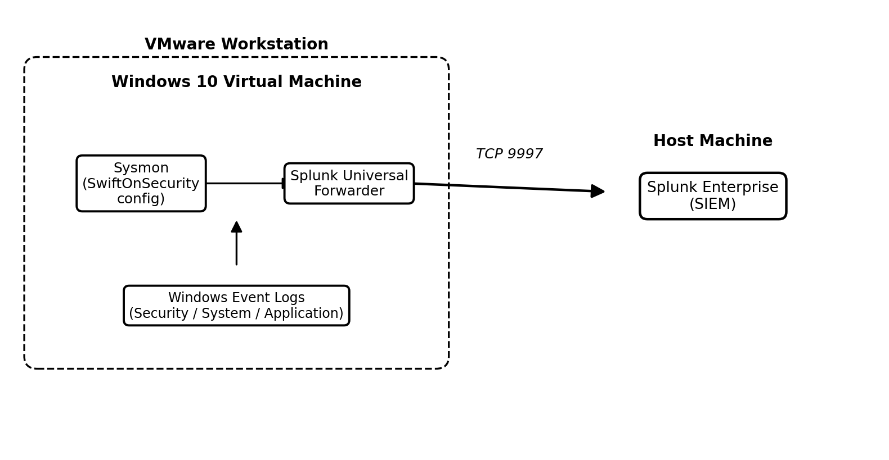

# SOC Home Lab — Phase 1: Windows Endpoint Monitoring with Splunk & Sysmon

**Author:** Kehinde Oyewumi
**Date:** August 2026

---

## Project Overview

This project is the first phase of a broader Security Operations Center (SOC) home lab build. The objective was to design and implement a working endpoint monitoring pipeline: a Windows 10 machine generating detailed system activity through Sysmon, with that activity forwarded to a centralized Splunk Enterprise instance acting as the SIEM. Rather than treating this as a single install-and-done task, the project was approached the way a SOC analyst would approach standing up new log sources in production: install each component individually, verify it works in isolation, connect the pieces, and validate the full path end-to-end before trusting the data.

The lab is built entirely on a single physical host using VMware Workstation. The Windows 10 virtual machine represents the monitored endpoint, while Splunk Enterprise runs directly on the host machine and plays the role of the central SIEM. A Kali Linux virtual machine is already present in the environment and is reserved for a later phase of the project. This document covers Phase 1 only: getting visibility working. Later phases will build on this foundation.
---

## Table of Contents
- [Project Overview](#project-overview)
- [Objectives](#objectives)
- [Tools Used](#tools-used)
- [Lab Architecture](#lab-architecture)
- [Walkthrough](#walkthrough)
- [Results (So Far)](#results-so-far)
- [Skills Demonstrated](#skills-demonstrated)
- [Next Steps](#next-steps)

---

## Objectives

- Set up a Windows 10 virtual machine in VMware Workstation to serve as the monitored endpoint
- Install and configure Splunk Enterprise on the host machine to act as the central SIEM
- Install the Splunk Universal Forwarder on the Windows VM to transmit log data to Splunk
- Install Sysmon on the Windows VM with the SwiftOnSecurity configuration for high-quality, low-noise event logging
- Configure log forwarding between the VM and Splunk Enterprise over the standard Splunk-to-Splunk port (9997)
- Verify that logs are actually being generated, forwarded, and searchable — not just that services report as running
- Diagnose and document any issues encountered along the way, rather than only presenting a clean end result

## Tools Used

| Component | Technology |
|----------|------------|
| Monitored Endpoint | Windows 10 (VMware Workstation) |
| SIEM Platform | Splunk Enterprise (host machine) |
| Log Forwarding Agent | Splunk Universal Forwarder |
| Endpoint Telemetry | Sysmon (SwiftOnSecurity configuration) |
| Future Attack Simulation | Kali Linux |
## Lab Architecture

The diagram below shows how the components in this lab relate to one another. The Windows 10 VM sits inside VMware Workstation and runs two things side by side: Sysmon, which watches the operating system and generates detailed telemetry (process creation, file creation, network connections, and more), and the Splunk Universal Forwarder, which is responsible for reading both Sysmon's event log and the standard Windows Event Logs (Security, System, Application) and shipping that data off the VM. The Forwarder sends everything over TCP port 9997 to Splunk Enterprise, which runs on the host machine outside the VM and is responsible for indexing the data and making it searchable.

  

<em>Figure 1. Log flow from the Windows 10 VM to Splunk Enterprise on the host machine.</em>

## Walkthrough

This project is documented as a set of linked, focused write-ups rather than one long file. Each one covers a single stage of the pipeline in full detail, with screenshots.

1. [Windows VM Setup](Windows%20VM%20Setup.md) — building the monitored endpoint in VMware Workstation
2. [Splunk Enterprise Installation](Splunk%20Enterprise%20Installation.md) — standing up the SIEM on the host machine
3. [Splunk Universal Forwarder Installation & Configuration](Splunk%20Universal%20Forwarder%20Installation%20and%20Configuration.md) — connecting the VM to Splunk Enterprise
4. [Sysmon Installation & Configuration](Sysmon%20Installation%20and%20Configuration.md) — adding high-quality endpoint telemetry with the SwiftOnSecurity config
5. [Troubleshooting: Sysmon Forwarding Issue](Troubleshooting%20-%20Sysmon%20Forwarding%20Issue.md) — a real configuration issue found and worked through during validation

## Results (So Far)

- Windows VM, Splunk Enterprise, and the Splunk Universal Forwarder were successfully deployed and connected end-to-end
- General Windows Event Log data (Security, System) is confirmed flowing into Splunk and is fully searchable
- Sysmon is confirmed to be correctly installed and actively generating detailed local telemetry (Event ID 11 and others), using the SwiftOnSecurity configuration
Sysmon telemetry is confirmed to be generated locally; however, Sysmon events are not yet being indexed in Splunk despite successful forwarding of standard Windows Event Logs. The investigation and troubleshooting process is documented in the dedicated troubleshooting write-up. — see the [troubleshooting write-up](Troubleshooting%20-%20Sysmon%20Forwarding%20Issue.md) for details

## Skills Demonstrated

- SIEM deployment and configuration (Splunk Enterprise)
- Windows Universal Forwarder setup, configuration, and troubleshooting
- Sysmon deployment using a community-maintained configuration (SwiftOnSecurity)
- Log forwarding architecture and configuration (TCP 9997, inputs.conf)
- SPL (Search Processing Language) search fundamentals for validating data ingestion
- Systematic, evidence-based troubleshooting of a log pipeline issue rather than guesswork
- Clear technical documentation of both successes and unresolved issues

## Next Steps

- Resolve the Sysmon-to-Splunk forwarding issue and confirm Sysmon events are fully searchable in Splunk
- **Phase 2:** introduce the Kali Linux VM to simulate attacks against the Windows endpoint
- Build detection searches, correlation rules, and dashboards in Splunk based on the telemetry captured from simulated attack activity
