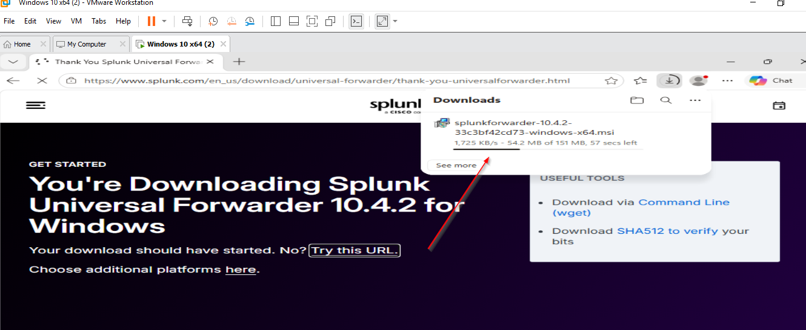
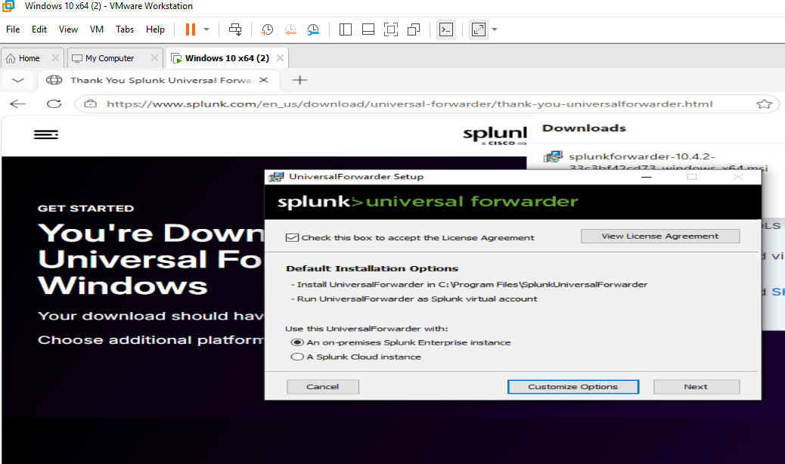
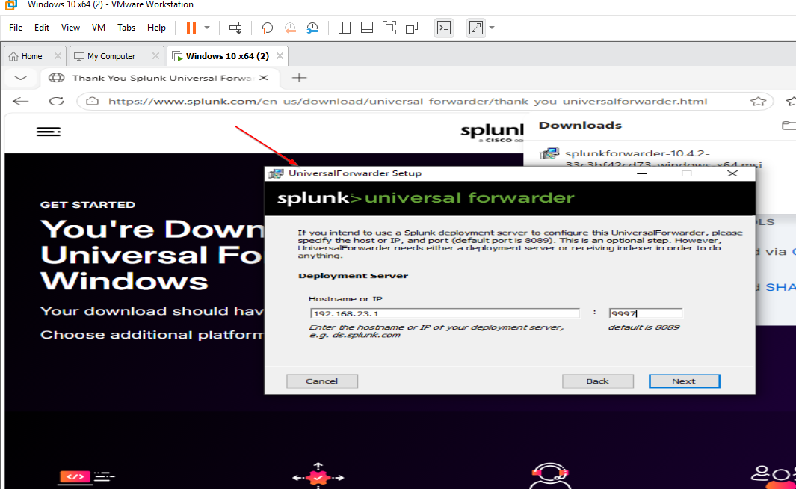
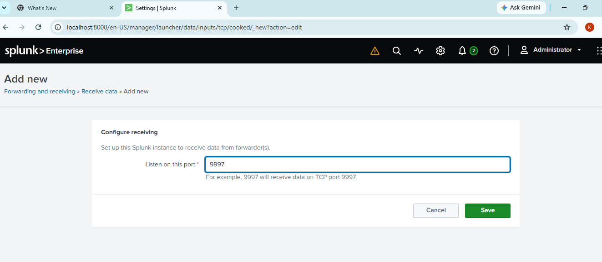
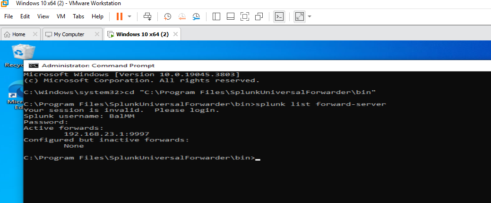
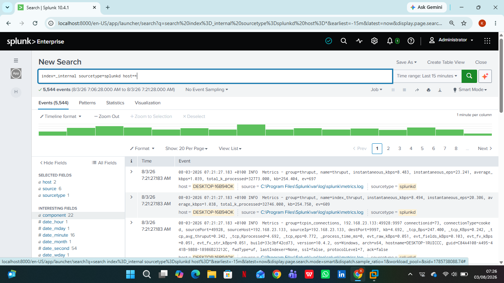

# Splunk Universal Forwarder Installation & Configuration

[← Back to project overview](README.md)

## Installing the Forwarder

For Splunk Enterprise to receive anything from the Windows VM, an agent needed to be running on that VM whose job is to read local log data and ship it off to the indexer. That agent is the Splunk Universal Forwarder. It was downloaded and installed inside the Windows 10 VM, and during setup, **On-Premises Splunk Enterprise Instance** was selected as the deployment type, since this lab does not use Splunk Cloud.

  

<em>Figure 11. Downloading the Splunk Universal Forwarder.</em>

---

  

<em>Figure 12. Universal Forwarder installation in progress.</em>

---

  

<em>Figure 13. Universal Forwarder setup — license agreement and instance type.</em>

---

## Configuring log forwarding

Installing the Forwarder alone does not create a working pipeline — both ends need to agree on where data is going and where it is expected to arrive. On the Windows VM side, the Universal Forwarder was configured with the host machine's IP address (`192.168.23.1`) and port `9997` as its receiving destination. On the Splunk Enterprise side, the platform was configured under **Forwarding and Receiving** to listen for incoming forwarder connections on that same port. Both sides of this configuration have to match for data to flow, which is why they are documented together here.

  

<em>Figure 14. Universal Forwarder configured with the receiving server address and port.</em>

---

  

<em>Figure 15. Splunk Enterprise configured to receive data on port 9997.</em>

---

## Confirming the Forwarder connection

Configuration alone does not guarantee a working connection, so this was verified directly rather than assumed. From the Windows VM command line, the forward-server status was checked, which confirmed an active forward to `192.168.23.1:9997`. This was then cross-checked from the Splunk Enterprise side by searching Splunk's internal logs (`index=_internal sourcetype=splunkd`), which returned thousands of events — proof that the Forwarder was not only configured correctly, but actively exchanging data with Splunk Enterprise in real time.

  

<em>Figure 16. Command-line confirmation of an active forward from the Windows VM.</em>

---

  

<em>Figure 17. Splunk Enterprise search confirming forwarder activity (`index=_internal sourcetype=splunkd`).</em>

---

Next: [Sysmon Installation & Configuration →](Sysmon%20Installation%20and%20Configuration.md)
