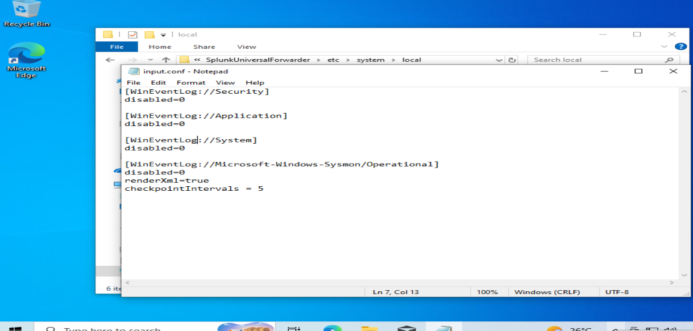
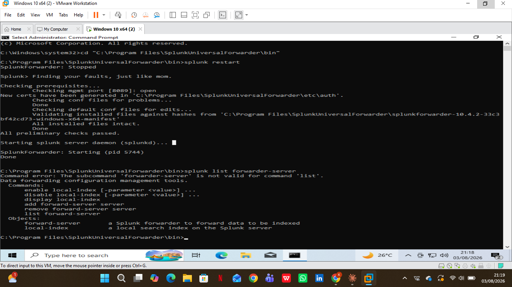

# Troubleshooting: Sysmon Forwarding Issue

[← Back to project overview](README.md)

This stage surfaced a real issue, and it is documented here in full rather than smoothed over, since diagnosing problems like this is a core part of SOC and log-pipeline work. General Windows Security and System logs were confirmed to be forwarding correctly and were fully searchable in Splunk. Sysmon-specific events, however, were not appearing in any Splunk search, despite Event Viewer clearly showing them being generated locally on the VM.

## Confirming the gap

To confirm this rather than assume it, the `EventCode` field for the Windows VM host was inspected directly in Splunk. The top values returned were all standard Windows Security event codes (4907, 5379, 4624, 4672, 4799, and others) — with no Sysmon-related event codes present anywhere in the results. This confirmed the gap was specific to Sysmon data, not a general forwarding failure.

  

<em>Figure 24. EventCode field breakdown showing only standard Windows Security event codes, confirming Sysmon events were not yet present in Splunk.</em>

---

## Root cause investigation

Reviewing the `inputs.conf` file line by line against the working stanzas turned up a typo in an unrelated stanza (`WinEventLogs://System` instead of `WinEventLog://System`), which was corrected. The Sysmon stanza itself was re-checked and appeared syntactically correct. The Universal Forwarder was restarted after the fix and reconfirmed as actively connected to Splunk Enterprise using the forward-server status check.

  

<em>Figure 25. Corrected inputs.conf file with the typo fixed.</em>

---

  

<em>Figure 26. Universal Forwarder restarted successfully following the configuration fix.</em>

---

## Current status

As of this writing, Sysmon events are still not appearing in Splunk search results even after this fix, and the issue is being actively investigated. Working hypotheses include the forwarder's internal checkpoint or service state not fully resetting on restart, an indexing or index-routing configuration issue on the Splunk Enterprise side, or a remaining problem with the Sysmon input stanza itself that has not yet been identified.

**This page will be updated with the resolution once the root cause is confirmed.**

---

[← Back to project overview](README.md)
