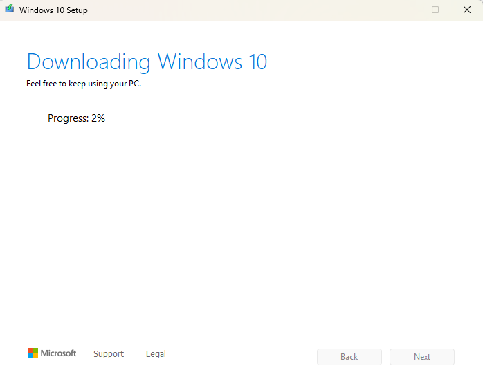
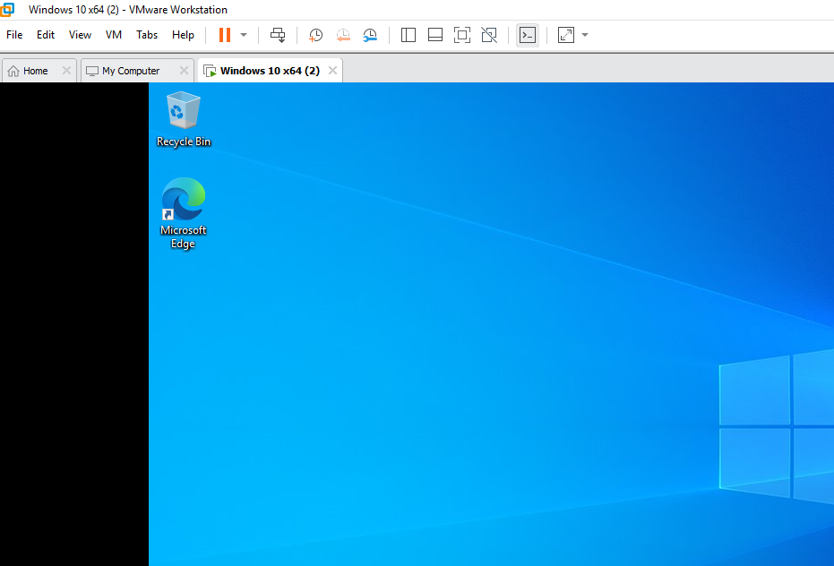

# Windows VM Setup

[← Back to project overview](README.md)

The first step was standing up the endpoint that would be monitored throughout the rest of the lab. A Windows 10 ISO was downloaded and used to create a new virtual machine in VMware Workstation. This VM was kept intentionally close to a default install — no additional hardening or software beyond what the lab required — since the goal at this stage was simply to have a realistic Windows endpoint to generate and monitor activity on.

  

<em>Figure 2. Downloading the Windows 10 installation image.</em>

---

  

<em>Figure 3. Creating the Windows 10 virtual machine disk in VMware Workstation.</em>

---

  

<em>Figure 4. Windows 10 VM running successfully, confirming the endpoint was ready for the next steps.</em>

---

Next: [Splunk Enterprise Installation →](Splunk%20Enterprise%20Installation.md)
